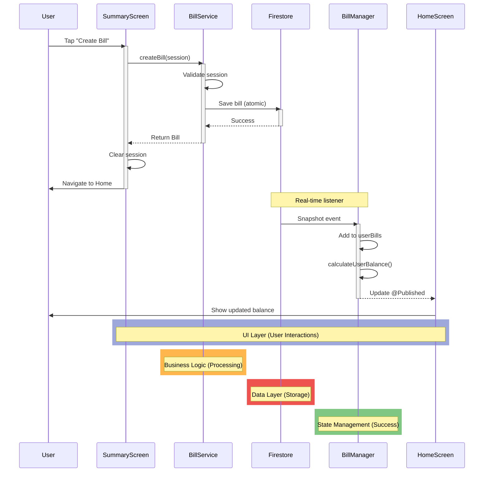

# SplitSmart Architecture Documentation

**Last Updated**: 2025-01-XX  
**Status**: Living Documentation  
**Purpose**: Comprehensive architecture reference for developers

---

## Table of Contents

1. [Architecture Overview](#architecture-overview)
2. [System Architecture](#system-architecture)
3. [Layer Responsibilities](#layer-responsibilities)
4. [Data Flow](#data-flow)
5. [State Management](#state-management)
6. [Service Layer](#service-layer)
7. [Data Models](#data-models)
8. [Security Architecture](#security-architecture)
9. [Performance Considerations](#performance-considerations)
10. [Error Handling](#error-handling)
11. [Testing Strategy](#testing-strategy)

---

## Architecture Overview

### Diagram Color Scheme

All diagrams in this document use a consistent color scheme based on component state and responsibility:

- **🔵 Purple/Blue (#9FA8DA)**: **UI Layer** - User-facing views, screens, and interactions
- **🟢 Green (#81C784)**: **State Management** - Success states, read operations, completed processes
- **🟠 Orange (#FFB74D)**: **Business Logic** - Processing, services, in-progress operations
- **🔴 Red (#EF5350)**: **Data Layer** - Firestore, storage, persistent data
- **🔷 Teal/Cyan (#4DB6AC)**: **Background Operations** - Async operations, background tasks

---

SplitSmart follows a **layered MVVM architecture** with clear separation of concerns:

```
┌─────────────────────────────────────────┐
│         SwiftUI Views (UI Layer)        │
│  (UIHomeScreen, UIScanScreen, etc.)     │
└─────────────────┬───────────────────────┘
                  │
┌─────────────────▼───────────────────────┐
│    ViewModels (State Management)        │
│  (BillManager, AuthViewModel, etc.)     │
└─────────────────┬───────────────────────┘
                  │
┌─────────────────▼───────────────────────┐
│      Services (Business Logic)          │
│  (BillService, OCRService, etc.)        │
└─────────────────┬───────────────────────┘
                  │
┌─────────────────▼───────────────────────┐
│         Data Layer (Firestore)          │
│  (Bills, Users, Activities, etc.)        │
└─────────────────────────────────────────┘
```

### Key Principles

1. **Separation of Concerns**: Each layer has distinct responsibilities
2. **Reactive UI**: SwiftUI automatically updates when state changes
3. **Unidirectional Data Flow**: Data flows down, events flow up
4. **Dependency Injection**: Services injected via environment objects
5. **Testability**: Business logic separated from UI

---

## System Architecture

### Component Diagram

```mermaid
graph TB
    subgraph "SwiftUI Layer"
        CV[ContentView]
        HS[UIHomeScreen]
        SV[UIScanScreen]
        AS[UIAssignScreen]
        SS[UISummaryScreen]
        HV[HistoryView]
        BD[BillDetailScreen]
        BE[BillEditFlow]
    end

    subgraph "State Management"
        BM[BillManager<br/>ObservableObject]
        AVM[AuthViewModel<br/>ObservableObject]
        BSS[BillSplitSession<br/>ObservableObject]
        CM[ContactsManager<br/>ObservableObject]
    end

    subgraph "Business Logic"
        BS[BillService]
        OS[OCRService]
        BC[BillCalculator]
        CD[ConflictDetectionService]
        RC[ReceiptClassifier]
    end

    subgraph "Data Layer"
        FS[(Firestore)]
        KC[Keychain]
        FM[FileManager]
    end

    CV --> BM
    CV --> AVM
    HS --> BM
    SV --> BSS
    AS --> BSS
    SS --> BS
    BD --> BS
    BE --> BS

    BM --> FS
    BS --> FS
    BS --> CD
    OS --> RC
    AVM --> FS
    BSS --> FM

    %% Color Scheme: Purple=UI, Green=State, Orange=Business Logic, Red=Data, Teal=Background
    style CV fill:#9FA8DA,stroke:#7986CB,stroke-width:2px,color:#fff
    style HS fill:#9FA8DA,stroke:#7986CB,stroke-width:2px,color:#fff
    style SV fill:#9FA8DA,stroke:#7986CB,stroke-width:2px,color:#fff
    style AS fill:#9FA8DA,stroke:#7986CB,stroke-width:2px,color:#fff
    style SS fill:#9FA8DA,stroke:#7986CB,stroke-width:2px,color:#fff
    style HV fill:#9FA8DA,stroke:#7986CB,stroke-width:2px,color:#fff
    style BD fill:#9FA8DA,stroke:#7986CB,stroke-width:2px,color:#fff
    style BE fill:#9FA8DA,stroke:#7986CB,stroke-width:2px,color:#fff
    
    style BM fill:#81C784,stroke:#66BB6A,stroke-width:2px,color:#fff
    style AVM fill:#81C784,stroke:#66BB6A,stroke-width:2px,color:#fff
    style BSS fill:#81C784,stroke:#66BB6A,stroke-width:2px,color:#fff
    style CM fill:#81C784,stroke:#66BB6A,stroke-width:2px,color:#fff
    
    style BS fill:#FFB74D,stroke:#FFA726,stroke-width:2px,color:#fff
    style OS fill:#FFB74D,stroke:#FFA726,stroke-width:2px,color:#fff
    style BC fill:#FFB74D,stroke:#FFA726,stroke-width:2px,color:#fff
    style CD fill:#FFB74D,stroke:#FFA726,stroke-width:2px,color:#fff
    style RC fill:#FFB74D,stroke:#FFA726,stroke-width:2px,color:#fff
    
    style FS fill:#EF5350,stroke:#E53935,stroke-width:2px,color:#fff
    style KC fill:#EF5350,stroke:#E53935,stroke-width:2px,color:#fff
    style FM fill:#EF5350,stroke:#E53935,stroke-width:2px,color:#fff
```



---

## Layer Responsibilities

### 1. UI Layer (SwiftUI Views)

**Location**: `SplitSmart/Views/`, `SplitSmart/UIComponents.swift`

**Responsibilities**:
- Render user interface
- Handle user interactions
- Display data from ViewModels
- Navigate between screens

**Key Views**:
- `ContentView`: Main navigation container
- `UIHomeScreen`: Dashboard with balances
- `UIScanScreen`: Receipt scanning interface
- `UIAssignScreen`: Item assignment interface
- `UISummaryScreen`: Bill review and creation
- `HistoryView`: Transaction history
- `BillDetailScreen`: Bill details view
- `BillEditFlow`: Bill editing flow

**Patterns**:
- Use `@ObservedObject` to observe ViewModels
- Use `@State` for local view state
- Use `@EnvironmentObject` for app-wide state
- Compose views from reusable components

### 2. State Management Layer (ViewModels)

**Location**: `SplitSmart/Models/DataModels.swift`, `SplitSmart/Models/AuthViewModel.swift`

**Responsibilities**:
- Manage UI state via `@Published` properties
- Connect to data sources (Firestore, services)
- Transform data for UI consumption
- Handle user session lifecycle

**Key ViewModels**:

#### BillManager
- **Purpose**: Real-time bill state management
- **Pattern**: ObservableObject with Firestore listeners
- **Responsibilities**:
  - Maintain `userBills` array
  - Calculate user balances
  - Track bill activities
  - Real-time synchronization via listeners
- **Does NOT**: Write to Firestore (read-only)

#### AuthViewModel
- **Purpose**: Authentication state management
- **Responsibilities**:
  - Track user sign-in status
  - Handle Google Sign-In
  - Manage user session
- **Properties**: `user`, `isSignedIn`, `isInitializing`

#### BillSplitSession
- **Purpose**: Temporary state during bill creation
- **Responsibilities**:
  - Track items, participants, totals
  - Manage session state (scanning, assigning, summary)
  - Persist session for recovery
- **Lifecycle**: Created per bill creation flow, cleared on completion

#### ContactsManager
- **Purpose**: Contact/participant management
- **Responsibilities**:
  - Manage user's contact list
  - Fetch participant details
  - Cache contact information

### 3. Business Logic Layer (Services)

**Location**: `SplitSmart/Models/Services/`

**Responsibilities**:
- Implement business rules
- Perform data operations (CRUD)
- Handle external API calls
- Coordinate between services

**Key Services**:

#### BillService
- **Purpose**: Bill lifecycle operations
- **Responsibilities**:
  - Create bills with validation
  - Update bills with optimistic locking
  - Delete bills (soft delete)
  - Handle conflict detection
- **Pattern**: Stateless service object
- **Error Handling**: Throws typed errors (`BillCreationError`, `BillUpdateError`)

#### OCRService
- **Purpose**: Receipt scanning and text extraction
- **Responsibilities**:
  - Process receipt images using Vision framework
  - Extract text and structure
  - Classify receipt items
  - Return structured `OCRResult`
- **Dependencies**: Apple Vision, ReceiptClassifier

#### ReceiptClassifier
- **Purpose**: Smart receipt item classification
- **Strategies**:
  1. **Geometric**: Position-based classification
  2. **Pattern Heuristic**: Keyword/format matching
  3. **Price Relationship**: Mathematical validation
  4. **Gemini AI**: LLM-based classification (fallback)
- **Output**: `ClassifiedReceipt` with categorized items

#### ConflictDetectionService
- **Purpose**: Concurrent edit conflict detection
- **Responsibilities**:
  - Compare local vs server bill versions
  - Detect conflicting changes
  - Auto-resolve simple conflicts
  - Report critical conflicts
- **Pattern**: Stateless utility service

#### BillCalculator
- **Purpose**: Balance calculations
- **Responsibilities**:
  - Calculate who owes what
  - Handle rounding adjustments
  - Validate bill totals
- **Pattern**: Static utility class

### 4. Data Layer

**Location**: Firestore, Keychain, FileManager

**Responsibilities**:
- Persist data
- Enforce security rules
- Provide real-time updates

**Data Collections**:

#### Firestore Collections

1. **`bills`**: Bill documents
   - Structure: `Bill` model
   - Security: Participants can read, creator can write
   - Indexes: `participantIds`, `createdBy`, `date`

2. **`users/{userId}`**: User documents
   - Structure: User profile data
   - Security: User can read/write own data

3. **`users/{userId}/billActivities`**: Activity history
   - Structure: `BillActivity` model
   - Security: Participants can read, creator can write

4. **`users/{userId}/transactionContacts`**: Contact list
   - Structure: `TransactionContact` model
   - Security: User can read/write own contacts

5. **`participants/{userId}`**: Public participant lookup
   - Structure: Participant snapshot
   - Security: Authenticated users can read

#### Local Storage

1. **Keychain**: Gemini API keys (secure storage)
2. **FileManager**: Session persistence (24-hour expiration)
3. **UserDefaults**: App preferences

---

## Data Flow

### Read Flow (Real-time)

```
Firestore → BillManager (listener) → @Published property → SwiftUI View → UI Update
```

1. **Firestore Listener**: `BillManager` sets up snapshot listener
2. **Data Update**: Firestore sends snapshot on change
3. **State Update**: `BillManager` updates `@Published userBills`
4. **UI Update**: SwiftUI automatically re-renders views
5. **Balance Recalculation**: `BillManager` recalculates balances

### Write Flow

```
User Action → View → Service → Validation → Firestore → Listener → State Update → UI Update
```

1. **User Action**: User taps "Create Bill"
2. **View Handler**: `UISummaryScreen` calls `BillService.createBill()`
3. **Validation**: `BillService` validates session data
4. **Firestore Write**: Atomic transaction saves bill
5. **Listener Update**: Firestore listener triggers in `BillManager`
6. **State Update**: `BillManager` updates `@Published` properties
7. **UI Update**: SwiftUI views automatically update

### Bill Creation Flow (Detailed)



---

## State Management

### SwiftUI Property Wrappers

#### @State
- **Usage**: Local view state
- **Example**: `@State private var selectedTab = "home"`
- **Scope**: Single view

#### @StateObject
- **Usage**: Create and own ObservableObject
- **Example**: `@StateObject private var billManager = BillManager()`
- **Scope**: View lifecycle
- **Initialization**: Created once, persists across view updates

#### @ObservedObject
- **Usage**: Observe existing ObservableObject
- **Example**: `@ObservedObject var billManager: BillManager`
- **Scope**: View lifecycle
- **Note**: View re-creates if object is recreated

#### @EnvironmentObject
- **Usage**: Receive object from parent
- **Example**: `@EnvironmentObject var authViewModel: AuthViewModel`
- **Scope**: View hierarchy
- **Injection**: `.environmentObject(authViewModel)`

#### @Binding
- **Usage**: Two-way binding
- **Example**: `@Binding var isPresented: Bool`
- **Scope**: Parent-child communication

### State Management Patterns

#### 1. Single Source of Truth
- `BillManager` is the single source for bill data
- All views read from `BillManager`
- Writes go through `BillService`, which updates Firestore
- Firestore listeners update `BillManager`

#### 2. Derived State
- Balances calculated from bills (not stored separately)
- `BillManager.calculateUserBalance()` computes on-demand
- Recalculates when bills change

#### 3. Session State
- `BillSplitSession` manages temporary bill creation state
- Persisted to disk for recovery
- Cleared on bill creation completion

---

## Service Layer

### Service Responsibilities

| Service | Read | Write | State | Thread |
|---------|------|-------|-------|--------|
| BillManager | ✅ (listeners) | ❌ | ✅ (@Published) | Main |
| BillService | ❌ | ✅ | ❌ | Background |
| OCRService | ❌ | ❌ | ✅ (processing) | Background |
| ConflictDetectionService | ❌ | ❌ | ❌ | Any |

### Service Communication

- **Services don't call each other directly**
- **Services don't manage UI state** (except ObservableObject services)
- **Views call services** for operations
- **Services update Firestore**, listeners update ViewModels

### Error Handling

Services throw typed errors:

```swift
enum BillCreationError: LocalizedError {
    case authenticationRequired
    case invalidData(String)
    case invalidAmount
    case participantNotFound
    case firestoreError(Error)
}
```

Views handle errors:

```swift
do {
    let bill = try await billService.createBill(...)
} catch let error as BillCreationError {
    // Show user-friendly error
}
```

---

## Data Models

### Core Models

#### Bill
```swift
struct Bill: Codable, Identifiable {
    let id: String
    let paidBy: String  // User ID
    let totalAmount: Double
    let items: [BillItem]
    let participants: [BillParticipant]
    let calculatedTotals: [String: Double]  // userID: amountOwed
    let version: Int  // Optimistic locking
    var isDeleted: Bool
    // ... metadata
}
```

#### BillItem
```swift
struct BillItem: Codable, Identifiable {
    let id: String
    var name: String
    var price: Double
    var participantIDs: [String]  // Who splits this item
}
```

#### BillParticipant
```swift
struct BillParticipant: Codable, Identifiable {
    let id: String  // Firebase UID
    let displayName: String
    let email: String
    let photoURL: String?
}
```

### Model Relationships

```
Bill
├── items: [BillItem]
├── participants: [BillParticipant]
└── calculatedTotals: [String: Double]  // userID → amountOwed

BillItem
└── participantIDs: [String]  // References BillParticipant.id
```

---

## Security Architecture

### Firestore Security Rules

**Location**: `infrastructure/firebase/firestore.rules`

**Key Rules**:

1. **Bills Collection**:
   - Read: Participants can read
   - Create: Authenticated users, must be participant
   - Update: Only creator can update
   - Delete: Only creator can soft-delete

2. **Users Collection**:
   - Read: Authenticated users (for lookups)
   - Write: Only owner can write

3. **Bill Activities**:
   - Read: User can read own activities
   - Write: Creator can write for all participants

### Authentication

- **Provider**: Google Sign-In via Firebase Auth
- **Session**: Managed by `AuthViewModel`
- **Token**: Firebase Auth token for Firestore access

### Authorization

- **Bill Access**: Participants can read, creator can write
- **Edit Authorization**: Only creator can edit (enforced in Firestore rules)
- **Delete Authorization**: Only creator can delete (enforced in Firestore rules)

---

## Performance Considerations

### Optimization Strategies

1. **Lazy Loading**: Use `LazyVStack` for long lists
2. **Caching**: `BillManager` caches bills in memory
3. **Debouncing**: Balance calculations debounced
4. **Pagination**: Future: Paginate bill history

### Performance Metrics

- **Bill Creation**: ~200-500ms (network dependent)
- **Balance Calculation**: <100ms for 50 bills
- **Listener Setup**: ~50ms per user
- **OCR Processing**: 2-5 seconds (depends on image size)

### Memory Management

- **Bill Cache**: ~1KB per bill
- **Session File**: <10KB
- **Listener Cleanup**: Automatic on logout

---

## Error Handling

### Error Types

1. **BillCreationError**: Bill creation failures
2. **BillUpdateError**: Bill update failures (including conflicts)
3. **BillDeleteError**: Bill deletion failures
4. **OCRError**: OCR processing failures
5. **ClassificationError**: Receipt classification failures

### Error Handling Patterns

1. **Typed Errors**: Use enum errors with associated values
2. **User-Friendly Messages**: Convert technical errors to user messages
3. **Retry Logic**: Automatic retry for transient failures
4. **Error Logging**: Log errors with context for debugging

### Conflict Resolution

1. **Detection**: `ConflictDetectionService` detects conflicts
2. **Severity**: Classify as low/medium/high/critical
3. **Auto-Resolution**: Simple conflicts auto-resolved
4. **User Resolution**: Critical conflicts require user input

---

## Testing Strategy

### Unit Tests

- **Location**: `SplitSmartTests/`
- **Coverage**: Business logic, calculations, classification
- **Frameworks**: XCTest

### Test Categories

1. **Bill Calculations**: `BillCalculator` tests
2. **Classification**: Receipt classification strategy tests
3. **Conflict Detection**: Conflict detection tests
4. **Services**: Service layer tests (mocked Firestore)

### Manual Testing

- **Firebase Emulator**: Local Firestore for testing
- **Test Accounts**: Multiple test accounts for multi-user scenarios
- **Edge Cases**: Test with large bills, many participants, etc.

---

## Key Architectural Decisions

### 1. Read/Write Separation

**Decision**: Separate `BillManager` (read) and `BillService` (write)

**Rationale**:
- Clear separation of concerns
- Prevents accidental writes from ViewModels
- Easier to test and maintain

### 2. Optimistic Locking

**Decision**: Use version-based optimistic locking for bill updates

**Rationale**:
- Prevents concurrent edit conflicts
- Better user experience than pessimistic locking
- Handles most conflicts automatically

### 3. Soft Deletion

**Decision**: Mark bills as deleted, don't hard-delete

**Rationale**:
- Preserves history for participants
- Allows recovery if needed
- Maintains referential integrity

### 4. Session Recovery

**Decision**: Persist bill creation sessions to disk

**Rationale**:
- Prevents data loss on app crash
- Better user experience
- 24-hour expiration prevents stale sessions

### 5. Real-time Listeners

**Decision**: Use Firestore snapshot listeners for real-time updates

**Rationale**:
- Automatic UI updates
- No manual refresh needed
- Efficient for collaborative features

---

## Future Architecture Considerations

### Potential Improvements

1. **Repository Pattern**: Abstract Firestore access
2. **Dependency Injection**: Use DI container for services
3. **Caching Layer**: Add caching layer between services and Firestore
4. **Offline Support**: Enhanced offline capabilities
5. **GraphQL**: Consider GraphQL for complex queries

### Scalability

- **Pagination**: Implement for large bill lists
- **Indexing**: Optimize Firestore indexes
- **Caching**: Add Redis for frequently accessed data
- **CDN**: Use CDN for static assets

---

**This is a living document. Update as architecture evolves.**

**See Also**:
- [Bill Services Overview](./architecture/bill-services-overview.md)
- [Data Flow Diagrams](./architecture/data-flow-diagram.md)
- [User Workflow Documentation](./USER_WORKFLOW.md)

