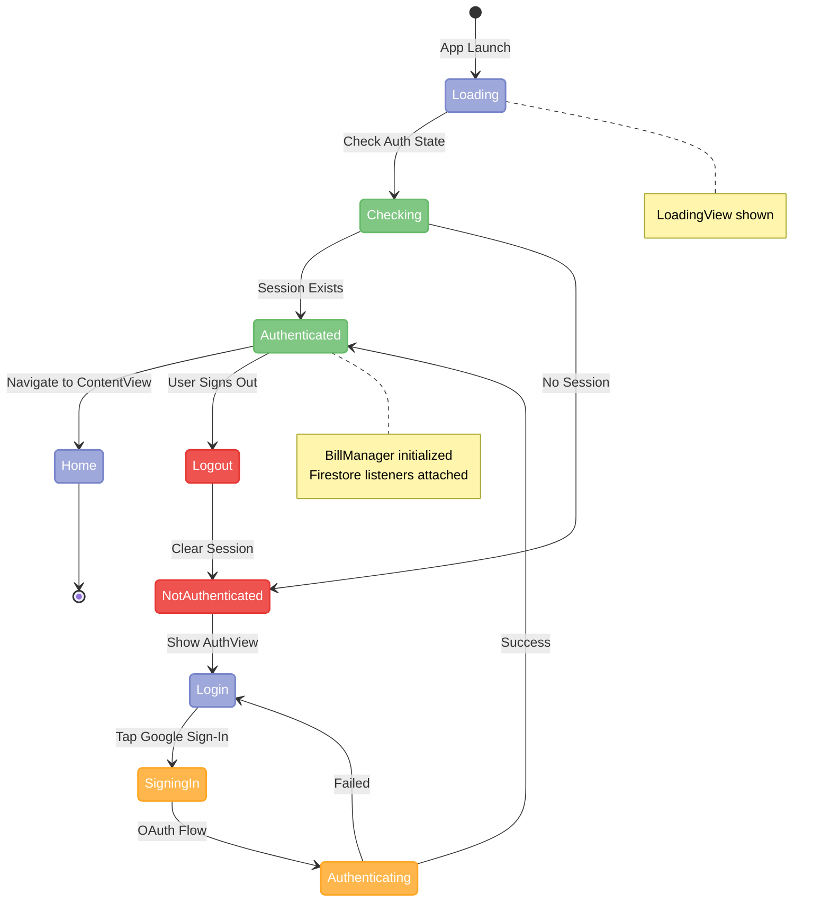
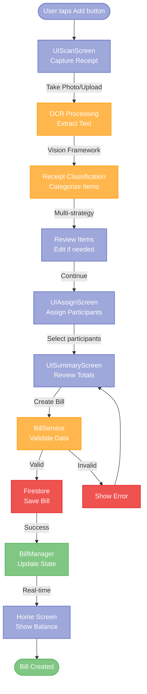
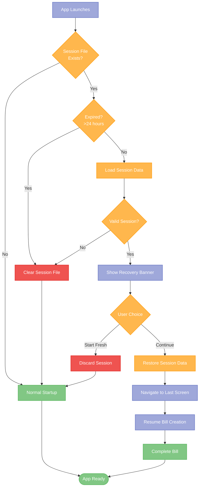
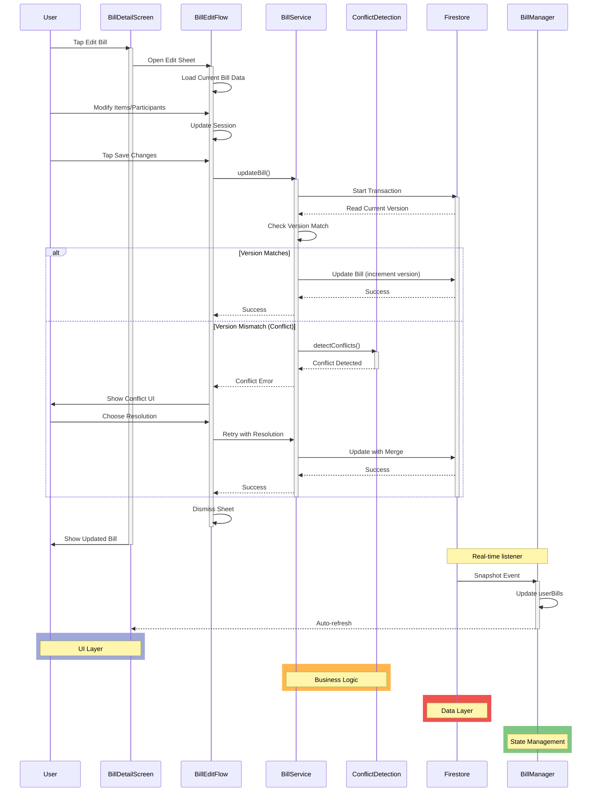
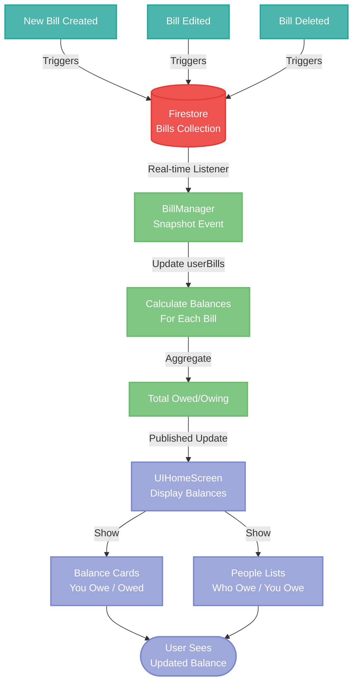

```mermaid
flowchart LR
    Start([User taps Add]) --> Manual[UIScanScreen<br/>Enter Manually]
    Manual -->|Add Items| Items[Enter Item Details<br/>Name & Price]
    Items -->|Repeat| More{More Items?}
    More -->|Yes| Items
    More -->|No| Assign[UIAssignScreen<br/>Assign Participants]
    Assign --> Summary[UISummaryScreen<br/>Review]
    Summary --> Create[Create Bill]
    Create --> Success([Bill Created])
    
    %% Color Scheme: Purple=UI, Green=Success, Orange=Processing
    style Start fill:#9FA8DA,stroke:#7986CB,stroke-width:2px,color:#fff
    style Manual fill:#9FA8DA,stroke:#7986CB,stroke-width:2px,color:#fff
    style Items fill:#9FA8DA,stroke:#7986CB,stroke-width:2px,color:#fff
    style Assign fill:#9FA8DA,stroke:#7986CB,stroke-width:2px,color:#fff
    style Summary fill:#9FA8DA,stroke:#7986CB,stroke-width:2px,color:#fff
    style Create fill:#FFB74D,stroke:#FFA726,stroke-width:2px,color:#fff
    style Success fill:#81C784,stroke:#66BB6A,stroke-width:2px,color:#fff
    style More fill:#FFB74D,stroke:#FFA726,stroke-width:2px,color:#fff
```

# SplitSmart User Workflow Documentation

**Last Updated**: 2025-01-XX  
**Status**: Living Documentation  
**Purpose**: Complete user workflow and feature documentation

---

## Table of Contents

1. [User Workflows Overview](#user-workflows-overview)
2. [Authentication Flow](#authentication-flow)
3. [Bill Creation Workflows](#bill-creation-workflows)
4. [Bill Management Workflows](#bill-management-workflows)
5. [Balance Tracking](#balance-tracking)
6. [History & Activity](#history--activity)
7. [Settings & Configuration](#settings--configuration)
8. [Error Scenarios](#error-scenarios)
9. [Edge Cases](#edge-cases)

---

## User Workflows Overview

### Diagram Color Scheme

All workflow diagrams in this document use a consistent color scheme based on state and operation type:

- **🔵 Purple/Blue (#9FA8DA)**: **UI Layer** - User interactions, screens, and user-facing components
- **🟢 Green (#81C784)**: **Success States** - Completed operations, successful outcomes, final states
- **🟠 Orange (#FFB74D)**: **Processing** - In-progress operations, business logic, validation
- **🔴 Red (#EF5350)**: **Data/Storage** - Firestore operations, data persistence, errors/clearing
- **🔷 Teal/Cyan (#4DB6AC)**: **Background Operations** - Async tasks, background processing

---

SplitSmart supports three main user workflows:

1. **Bill Creation**: Create bills from receipts or manual entry
2. **Bill Management**: Edit, view, and delete bills
3. **Balance Tracking**: View balances and settle up

---

## Authentication Flow

**Visual Flow**:

### First-Time User

1. **Launch App**: App shows loading screen
2. **Authentication Check**: App checks for existing session
3. **Login Screen**: If not authenticated, shows `AuthView`
4. **Google Sign-In**: User taps "Sign in with Google"
5. **OAuth Flow**: Google OAuth flow (browser or in-app)
6. **Firebase Auth**: Firebase creates/authenticates user
7. **User Profile**: App creates participant record in Firestore
8. **Home Screen**: Navigate to `ContentView` → `UIHomeScreen`

### Returning User

1. **Launch App**: App shows loading screen
2. **Session Check**: `AuthViewModel` checks Firebase Auth session
3. **Auto-Login**: If valid session exists, auto-login
4. **Home Screen**: Navigate directly to home (no login screen)

### Logout Flow

1. **Profile Screen**: User taps "Sign Out"
2. **Confirmation**: Optional confirmation dialog
3. **Sign Out**: `AuthViewModel.signOut()` called
4. **Cleanup**: 
   - Clear `BillManager` listeners
   - Clear session data
   - Clear cached data
5. **Login Screen**: Navigate to `AuthView`

---

## Bill Creation Workflows

### Workflow 1: Receipt Scanning

**Purpose**: Create bill from receipt photo

**Visual Flow**:

**Steps**:

1. **Start Flow**
   - User taps "Add" button on home screen
   - `ContentView.startNewBill()` called
   - Navigate to `UIScanScreen`
   - `BillSplitSession` initialized

2. **Capture Receipt**
   - User taps "Take Photo" or "Choose from Library"
   - Camera/photo picker presented
   - User captures/selects receipt image
   - Image loaded into `OCRService`

3. **OCR Processing**
   - `OCRService.processImage()` called
   - Apple Vision framework extracts text
   - Progress indicator shown (0% → 100%)
   - Text parsed into potential items
   - Total amount detected (if available)

4. **Classification** (Optional)
   - `ReceiptClassifier` classifies items
   - Strategies: Geometric → Pattern → Price → Gemini AI
   - Items categorized (food, tax, tip, etc.)
   - Confidence scores assigned

5. **Review Items**
   - `UIScanScreen` displays extracted items
   - User can:
     - Edit item names
     - Edit item prices
     - Add missing items
     - Remove incorrect items
   - Total amount displayed and editable

6. **Continue to Assign**
   - User taps "Continue"
   - `ContentView.moveToAssign()` called
   - Navigate to `UIAssignScreen`
   - Items loaded into session

7. **Assign Items**
   - User selects participants for each item
   - Multiple participants can be assigned per item
   - Tax and tip can be assigned to specific participants
   - Running total updates in real-time

8. **Review Summary**
   - User taps "Continue"
   - `ContentView.moveToSummary()` called
   - Navigate to `UISummaryScreen`
   - Summary shows:
     - Total amount
     - Who paid
     - Who owes what
     - Item breakdown

9. **Create Bill**
   - User taps "Create Bill"
   - `BillService.createBill()` called
   - Validation:
     - At least one item
     - Total amount > 0
     - Payer exists in participants
   - Bill saved to Firestore (atomic transaction)
   - Session cleared
   - Navigate to home screen

10. **Real-time Update**
    - Firestore listener triggers in `BillManager`
    - `userBills` updated
    - Balance recalculated
    - Home screen updates automatically

**Session State**:
- `sessionState`: `.scanning` → `.assigning` → `.summary` → `.complete`
- Persisted to disk for recovery (24-hour expiration)

### Workflow 2: Manual Entry

**Purpose**: Create bill without receipt

**Visual Flow**:

**Steps**:

1. **Start Flow**
   - User taps "Add" button on home screen
   - Navigate to `UIScanScreen`
   - User taps "Enter Manually" button
   - `BillSplitSession.entryMethod = .manual`

2. **Add Items**
   - User taps "Add Item"
   - Text field for item name
   - Text field for item price
   - User enters item details
   - Item added to session
   - Repeat for all items

3. **Continue to Assign**
   - Same as Workflow 1, step 6

4. **Assign Items**
   - Same as Workflow 1, step 7

5. **Review Summary**
   - Same as Workflow 1, step 8

6. **Create Bill**
   - Same as Workflow 1, step 9

**Differences from Scanning**:
- No OCR processing
- No classification
- User enters all data manually
- Faster workflow (fewer steps)

### Workflow 3: Session Recovery

**Purpose**: Recover incomplete bill creation session

**Trigger**: App launches with incomplete session (< 24 hours old)

**Visual Flow**:

**Steps**:

1. **App Launch**
   - `SessionRecoveryManager.checkForSavedSession()` called
   - `SessionPersistenceManager` checks for session file
   - If found and not expired, session loaded

2. **Recovery Banner**
   - `SessionRecoveryBanner` displayed at top of screen
   - Shows "Unfinished Bill" message
   - Two options: "Start Fresh" or "Continue"

3. **User Choice**:
   - **Start Fresh**: 
     - Session discarded
     - Normal app startup
   - **Continue**:
     - `BillSplitSession.restoreFrom()` called
     - Session data restored
     - Navigate to last screen (scan/assign/summary)
     - User continues where they left off

**Session Persistence**:
- Saved automatically when:
  - App goes to background
  - User navigates between screens
  - Memory warning received
- Expires after 24 hours
- Cleared on bill creation completion

---

## Bill Management Workflows

### Workflow 1: View Bill Details

**Purpose**: View complete bill information

**Steps**:

1. **Navigate to Bill**
   - From History: Tap bill in `HistoryView`
   - From Home: Tap bill in recent bills (if implemented)

2. **Bill Detail Screen**
   - `BillDetailScreen` or `SimpleBillDetailView` displayed
   - Shows:
     - Bill name and total
     - Date and time
     - Who paid
     - Items with prices
     - Who owes what (calculated totals)
     - Participant list

3. **Real-time Updates**
   - If bill is edited by another user:
     - Firestore listener triggers
     - `BillManager` updates bill
     - Detail screen refreshes automatically

### Workflow 2: Edit Bill

**Purpose**: Modify existing bill

**Prerequisites**: User must be bill creator

**Visual Flow**:

**Steps**:

1. **Open Bill**
   - Navigate to bill detail screen
   - If user is creator, "Edit Bill" button visible

2. **Start Edit**
   - User taps "Edit Bill"
   - `BillEditFlow` presented as sheet
   - Current bill data loaded into `BillEditSession`

3. **Edit Items**
   - User can:
     - Edit item names
     - Edit item prices
     - Add new items
     - Delete items
     - Reassign items to participants

4. **Review Changes**
   - `BillEditSummaryScreen` shows:
     - Original bill data
     - Modified bill data
     - Changes highlighted
     - New totals

5. **Confirm Edit**
   - User taps "Save Changes"
   - `BillService.updateBill()` called
   - Optimistic locking check:
     - Read current bill version from Firestore
     - Compare with expected version
     - If mismatch: Conflict detection
     - If match: Update with incremented version

6. **Conflict Resolution** (if needed)
   - `ConflictDetectionService` analyzes conflicts
   - If auto-resolvable: Auto-merge
   - If not: Show conflict UI
   - User chooses: Keep local, keep server, or manual merge

7. **Save Success**
   - Bill updated in Firestore
   - Detail screen updates automatically
   - Edit sheet dismissed

### Workflow 3: Delete Bill

**Purpose**: Remove bill (soft delete)

**Prerequisites**: User must be bill creator

**Steps**:

1. **Open Bill**
   - Navigate to bill detail screen
   - "Delete Bill" button visible (creator only)

2. **Confirm Deletion**
   - User taps "Delete Bill"
   - Confirmation alert shown:
     - Title: "Delete Bill"
     - Message: "Are you sure? This action cannot be undone."
     - Options: "Cancel" or "Delete"

3. **Delete Bill**
   - User confirms deletion
   - `BillService.deleteBill()` called
   - Soft delete performed:
     - `isDeleted = true`
     - `deletedBy = userId`
     - `deletedByDisplayName = user name`
     - `deletedAt = timestamp`
   - Bill activity recorded for all participants

4. **UI Update**
   - Bill marked as deleted in `BillManager`
   - History view shows "DELETED" label
   - Detail screen shows deletion message
   - Delete button hidden

**Note**: Bills are never hard-deleted. Deleted bills remain in database with `isDeleted = true` flag.

---

## Balance Tracking

### Home Screen Dashboard

**Purpose**: View current balances and debts

**Visual Flow**:

**Display**:

1. **Balance Cards**
   - "You are owed": Total amount others owe you
   - "You owe": Total amount you owe others
   - Net balance: Difference (if implemented)

2. **People Who Owe You**
   - List of people who owe you money
   - Per-person total
   - Color-coded avatars

3. **People You Owe**
   - List of people you owe money
   - Per-person total
   - Color-coded avatars

4. **All Settled Up**
   - Message shown if no outstanding balances

**Real-time Updates**:
- Balances update automatically when bills change
- No manual refresh needed
- Updates triggered by Firestore listeners

### Balance Calculation

**Algorithm**:

1. **For each bill**:
   - If user is payer (`paidBy == userId`):
     - For each participant:
       - Add `calculatedTotals[participantId]` to "You are owed"
   - If user is participant:
     - Add `calculatedTotals[userId]` to "You owe"

2. **Net Balance**:
   - `netBalance = totalOwed - totalOwe`
   - Positive: Others owe you
   - Negative: You owe others

**Performance**:
- Calculated on-demand when bills change
- <100ms for 50 bills
- Cached in `BillManager.userBalance`

---

## History & Activity

### History View

**Purpose**: View all bills user participated in

**Display**:

1. **Bill List**
   - All bills (including deleted)
   - Sorted by date (newest first)
   - Shows:
     - Bill name
     - Total amount
     - Date
     - Status (deleted, if applicable)
     - Your portion (if you owe)

2. **Bill Details**
   - Tap bill to view details
   - `SimpleBillDetailView` or `BillDetailView` shown
   - Full bill breakdown

3. **Filtering** (Future)
   - Filter by date range
   - Filter by participant
   - Filter by amount range
   - Search by bill name

### Bill Activity Tracking

**Purpose**: Track bill-related activities

**Activity Types**:
- `created`: Bill created
- `edited`: Bill edited
- `deleted`: Bill deleted

**Display**:
- Activity history per user
- Shows who did what and when
- Stored in `users/{userId}/billActivities`

**Real-time Updates**:
- Activities added when bills change
- History view updates automatically

---

## Settings & Configuration

### Profile Settings

**Location**: `UIProfileScreen`

**Accessible Options**:
- User profile information (name, email, photo)
- Delete account
- Sign out

**Note**: `AdvancedSettingsView` and `GeminiSettingsView` exist in the codebase but are not currently accessible from the Profile screen navigation. They may be implemented in a future update.

---

## Error Scenarios

### Scenario 1: Network Error

**Symptom**: Bill creation/update fails

**User Experience**:
1. Error alert shown
2. Message: "Unable to save bill. Please check your connection."
3. User can retry or cancel

**Technical**:
- `BillService` throws `BillCreationError.firestoreError`
- View catches error and displays alert
- User can retry operation

### Scenario 2: Conflict Detection

**Symptom**: Bill edited by another user simultaneously

**User Experience**:
1. Edit attempt fails
2. Conflict alert shown
3. Options:
   - "Refresh and Retry": Load latest version and re-edit
   - "View Changes": See what changed
   - "Cancel": Discard changes

**Technical**:
- `BillService` detects version mismatch
- `ConflictDetectionService` analyzes conflicts
- If critical: User must resolve manually
- If simple: Auto-resolve if possible

### Scenario 3: OCR Failure

**Symptom**: Receipt text extraction fails

**User Experience**:
1. Error message shown
2. Options:
   - "Try Again": Retry OCR
   - "Enter Manually": Switch to manual entry

**Technical**:
- `OCRService` throws `OCRError`
- View catches error
- User can retry or switch to manual

### Scenario 4: Session Expired

**Symptom**: Session recovery fails (expired)

**User Experience**:
1. Session file found but expired
2. Session automatically cleared
3. Normal app startup (no recovery banner)

**Technical**:
- `SessionPersistenceManager` checks expiration
- If expired: File deleted
- No recovery banner shown

---

## Edge Cases

### Edge Case 1: Large Bill (Many Items)

**Scenario**: Bill with 50+ items

**Handling**:
- UI uses `LazyVStack` for performance
- Items loaded on-demand
- Scroll performance optimized

### Edge Case 2: Many Participants

**Scenario**: Bill with 20+ participants

**Handling**:
- UI uses efficient rendering for large participant lists
- Optimized data loading for large groups

### Edge Case 3: Concurrent Edits

**Scenario**: Two users edit same bill simultaneously

**Handling**:
- Optimistic locking prevents conflicts
- First edit succeeds
- Second edit detects conflict
- Conflict resolution UI shown

### Edge Case 4: Offline Mode

**Scenario**: User creates bill while offline

**Handling**:
- Firestore handles offline persistence
- Bill queued for sync when online
- User sees "Pending" status (if implemented)

### Edge Case 5: Deleted Participant

**Scenario**: Participant account deleted

**Handling**:
- Participant marked as `isActive = false`
- Bills remain accessible
- Display name shows "Deleted User"
- Balances still calculated correctly

---

## User Interface States

### Loading States

1. **Initial Load**: App checking authentication
2. **Bill Loading**: Loading bills from Firestore
3. **OCR Processing**: Processing receipt image
4. **Bill Creation**: Saving bill to Firestore

### Empty States

1. **No Bills**: "No bills yet" message
2. **No Contacts**: "Add contacts" prompt
3. **No Balances**: "All settled up" message

### Error States

1. **Network Error**: Connection error message
2. **Auth Error**: Login error message
3. **Validation Error**: Form validation errors

---

## Feature Matrix

| Feature | Status | Notes |
|---------|--------|-------|
| Receipt Scanning | ✅ Complete | OCR + Classification |
| Manual Entry | ✅ Complete | Full item management |
| Bill Editing | ✅ Complete | With conflict detection |
| Bill Deletion | ✅ Complete | Soft delete |
| Balance Tracking | ✅ Complete | Real-time updates |
| History View | ✅ Complete | All bills |
| Session Recovery | ✅ Complete | 24-hour expiration |
| Groups | 🚧 Future | Not implemented |
| Payments | 🚧 Future | Not implemented |

---

## User Journey Maps

### New User Journey

1. **Download App** → Install
2. **First Launch** → See login screen
3. **Sign In** → Google Sign-In
4. **Home Screen** → See empty state
5. **Create First Bill** → Scan receipt or enter manually
6. **Add Friends** → Add participants
7. **Split Bill** → Assign items
8. **View Balance** → See who owes what

### Returning User Journey

1. **Launch App** → Auto-login
2. **Home Screen** → See balances
3. **Check History** → View past bills
4. **Create New Bill** → Quick bill creation
5. **Settle Up** → Track payments (future)

---

**This is a living document. Update as features evolve.**

**See Also**:
- [Architecture Documentation](./ARCHITECTURE.md)
- [Bill Services Overview](./architecture/bill-services-overview.md)
- [Data Flow Diagrams](./architecture/data-flow-diagram.md)

